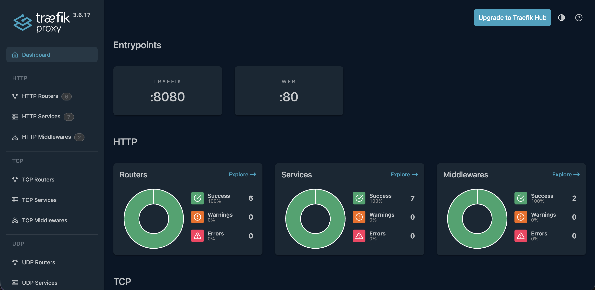
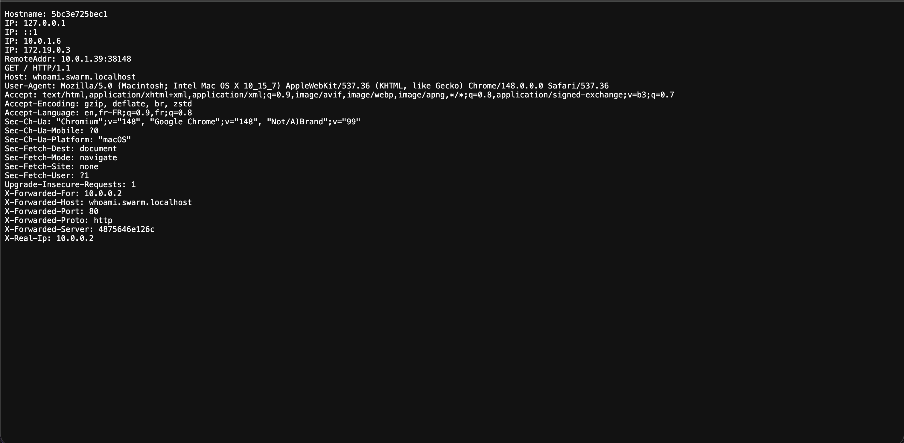
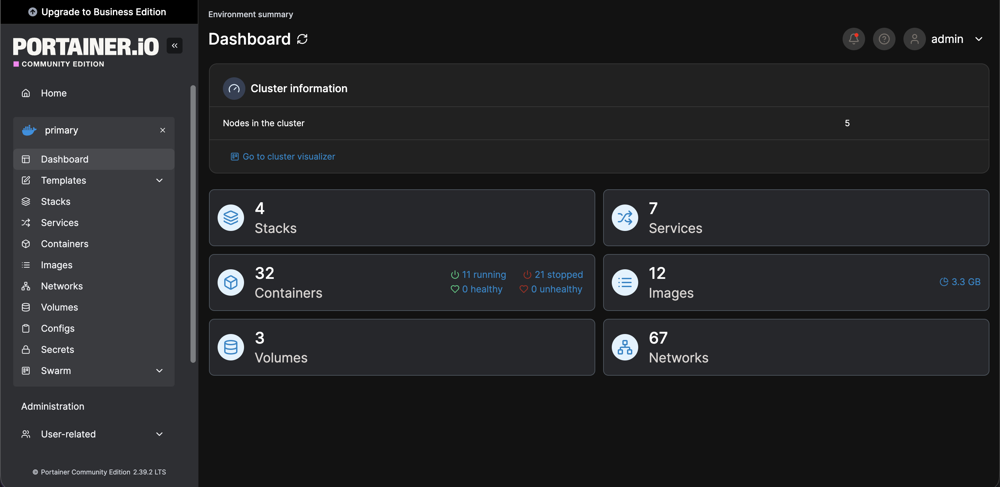
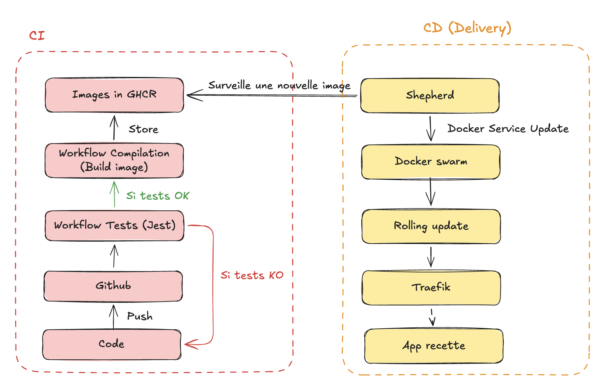

# Exo 2

**Commande :**

```bash
docker compose up -d
```

**Résultat :**

Lance le conteneur manager et les trois conteneurs des nœuds avec l'image `docker:dind`.

---

**Commande :**

```bash
docker ps
```

**Résultat :**

```
dfff61743f94   docker:dind   "dockerd-entrypoint.…"   19 seconds ago   Up 18 seconds   2375-2376/tcp                                 infra-manager-1
ddc8e4b8e564   docker:dind   "dockerd-entrypoint.…"   19 seconds ago   Up 18 seconds   2375-2376/tcp                                 infra-node2-1
b2ded58a9592   docker:dind   "dockerd-entrypoint.…"   19 seconds ago   Up 18 seconds   2375-2376/tcp                                 infra-node3-1
14507f3b95d8   docker:dind   "dockerd-entrypoint.…"   19 seconds ago   Up 18 seconds   2375-2376/tcp                                 infra-node1-1
```

On voit bien nos quatre conteneurs lancés avec les bonnes images.

---

**Commande :**

```bash
docker exec -it dfff61743f94 ash
```

**Résultat :**

On entre dans le conteneur manager.

---

**Commande :**

```bash
docker swarm init
```

**Résultat :**

```
Swarm initialized: current node (qps9dh4uhz95p8yspt39cxeqc) is now a manager.

To add a worker to this swarm, run the following command:

    docker swarm join --token SWMTKN-1-1r8v7cmeuu6f6o1i98487ho6q1zzwldpjts9als93i4vtecvot-dx4cm4fxs7wu8apciygpd4sp7 172.21.0.4:2377

To add a manager to this swarm, run 'docker swarm join-token manager' and follow the instructions.
```

---

**Commande :**

```bash
docker exec -it b2ded58a9592 ash
docker swarm join --token SWMTKN-1-1r8v7cmeuu6f6o1i98487ho6q1zzwldpjts9als93i4vtecvot-dx4cm4fxs7wu8apciygpd4sp7 manager:2377
```

**Résultat :**

On fait rejoindre le nœud au cluster Docker Swarm.

**Commentaire :**

On effectue la même opération pour tous les nœuds.

---

**Commande :**

```bash
docker node ls
```

**Résultat :**

On voit bien notre cluster avec le manager et tous les nœuds.

---

# Exo 3

**Commande :**

```bash
docker cp ./hello-world.compose.yml dfff61743f94:/home/manager
```

**Résultat :**

Cela copie le fichier de la stack hello-world dans le conteneur manager.

---

**Commande :**

```bash
docker exec -it dfff61743f94 ash
docker stack deploy -c hello-world.compose.yml hello-world-stack
```

**Résultat :**

```
Since --detach=false was not specified, tasks will be created in the background.
In a future release, --detach=false will become the default.
Creating network hello-world-stack_default
Creating service hello-world-stack_hello-world
```

---

**Commande :**

```bash
docker service ls
```

**Résultat :**

```
ID             NAME                      MODE         REPLICAS   IMAGE                   PORTS
sgep5etvssle   hello-world_hello-world   replicated   2/2        traefik/whoami:latest
```

**Commentaire :**

On voit bien que la stack est déployée. J'ai changé l'image de la stack car, après quelques recherches, l'image `nmatsui/hello-world-api` ne fonctionnait pas sur mon ARM.

---

**Commande :**

```bash
docker exec -it b2ded58a9592 ash
docker ps
```

**Résultat :**

**Commentaire :**

On effectue ces opérations sur tous les nœuds. On observe que, sur certains, l'image tourne et, sur d'autres, non.
On voit donc bien que l'image tourne sur deux réplicas, comme indiqué dans la partie deploy de la stack.

---

# Exo 4

**Commande :**

```bash
docker compose up -d --scale node=3
docker ps
```

**Résultat :**

```
cfdf474cc67b   esgi-2604-ansible-node      "dockerd-entrypoint.…"   5 seconds ago   Up 4 seconds   2375-2376/tcp                                 esgi-2604-ansible-node-2
274d1fba2a2e   esgi-2604-ansible-node      "dockerd-entrypoint.…"   5 seconds ago   Up 3 seconds   2375-2376/tcp                                 esgi-2604-ansible-node-1
cc6686cd1eae   esgi-2604-ansible-node      "dockerd-entrypoint.…"   5 seconds ago   Up 3 seconds   2375-2376/tcp                                 esgi-2604-ansible-node-3
fba541638ee8   esgi-2604-ansible-manager   "dockerd-entrypoint.…"   5 seconds ago   Up 4 seconds   2375-2376/tcp                                 esgi-2604-ansible-manager-1
```

**Commentaire :**

J'utilise l'option scale afin de lancer 3 conteneurs node.
Le `docker ps` me confirme que les 4 conteneurs sont bien lancés.

---

**Commande :**

```bash
bash ansible.sh
```

**Résultat :**

```
✅ Running Ansible Playbooks...

PLAY [Initialize Docker Swarm] *******************************************************************************************************************************************************************************************************

TASK [Gathering Facts] ***************************************************************************************************************************************************************************************************************
[WARNING]: Host 'esgi-2604-ansible-manager-1' is using the discovered Python interpreter at '/usr/bin/python3.12', but future installation of another Python interpreter could cause a different interpreter to be discovered. See https://docs.ansible.com/ansible-core/2.20/reference_appendices/interpreter_discovery.html for more information.
ok: [esgi-2604-ansible-manager-1]

TASK [Initialize swarm on first manager] *********************************************************************************************************************************************************************************************
changed: [esgi-2604-ansible-manager-1]

TASK [Retrieve worker join token] ****************************************************************************************************************************************************************************************************
changed: [esgi-2604-ansible-manager-1]

TASK [Set worker join token as a fact] ***********************************************************************************************************************************************************************************************
ok: [esgi-2604-ansible-manager-1]

TASK [Check join command (for workers)] **********************************************************************************************************************************************************************************************
ok: [esgi-2604-ansible-manager-1] => {
    "worker_join_command": "docker swarm join --token SWMTKN-1-2dmxh4yzt0vx3hkwqt6g70x12b8hb55euxmlef9jzsf2sbqjfv-1weol1bh0p9m7z3jf8q1gnszc"
}

PLAY [Join workers to the Swarm cluster] *********************************************************************************************************************************************************************************************

TASK [Gathering Facts] ***************************************************************************************************************************************************************************************************************
[WARNING]: Host 'esgi-2604-ansible-node-3' is using the discovered Python interpreter at '/usr/bin/python3.12', but future installation of another Python interpreter could cause a different interpreter to be discovered. See https://docs.ansible.com/ansible-core/2.20/reference_appendices/interpreter_discovery.html for more information.
ok: [esgi-2604-ansible-node-3]
[WARNING]: Host 'esgi-2604-ansible-node-1' is using the discovered Python interpreter at '/usr/bin/python3.12', but future installation of another Python interpreter could cause a different interpreter to be discovered. See https://docs.ansible.com/ansible-core/2.20/reference_appendices/interpreter_discovery.html for more information.
ok: [esgi-2604-ansible-node-1]
[WARNING]: Host 'esgi-2604-ansible-node-2' is using the discovered Python interpreter at '/usr/bin/python3.12', but future installation of another Python interpreter could cause a different interpreter to be discovered. See https://docs.ansible.com/ansible-core/2.20/reference_appendices/interpreter_discovery.html for more information.
ok: [esgi-2604-ansible-node-2]

TASK [Join swarm as worker] **********************************************************************************************************************************************************************************************************
changed: [esgi-2604-ansible-node-1]
changed: [esgi-2604-ansible-node-2]
changed: [esgi-2604-ansible-node-3]

PLAY RECAP ***************************************************************************************************************************************************************************************************************************
esgi-2604-ansible-manager-1 : ok=5    changed=2    unreachable=0    failed=0    skipped=0    rescued=0    ignored=0
esgi-2604-ansible-node-1   : ok=2    changed=1    unreachable=0    failed=0    skipped=0    rescued=0    ignored=0
esgi-2604-ansible-node-2   : ok=2    changed=1    unreachable=0    failed=0    skipped=0    rescued=0    ignored=0
esgi-2604-ansible-node-3   : ok=2    changed=1    unreachable=0    failed=0    skipped=0    rescued=0    ignored=0
```

---

**Commande :**

```bash
docker exec -it fba541638ee8 ash
docker node ls
```

**Résultat :**

```
ID                            HOSTNAME       STATUS    AVAILABILITY   MANAGER STATUS   ENGINE VERSION
bmv7z77qq99eofquu3vt595mw     274d1fba2a2e   Ready     Active                          29.3.1
dm3d8arwvbttmrq4hleaetvwr     cc6686cd1eae   Ready     Active                          29.3.1
xrck8kb83rneqt5kcc7r905ig     cfdf474cc67b   Ready     Active                          29.3.1
yie0j6ht4esbcjp779bhyorxm *   fba541638ee8   Ready     Active         Leader           29.3.1
```

**Commentaire :**

On voit bien que tous les nœuds sont bien créés.

---

**Commande :**

```bash
bash ansible.sh
```

**Résultat :**

```
✅ Running Ansible Playbooks...

PLAY [Initialize Docker Swarm] *******************************************************************************************************************************************************************************************************

TASK [Gathering Facts] ***************************************************************************************************************************************************************************************************************
[WARNING]: Host 'esgi-2604-ansible-manager-1' is using the discovered Python interpreter at '/usr/bin/python3.12', but future installation of another Python interpreter could cause a different interpreter to be discovered. See https://docs.ansible.com/ansible-core/2.20/reference_appendices/interpreter_discovery.html for more information.
ok: [esgi-2604-ansible-manager-1]

TASK [Initialize swarm on first manager] *********************************************************************************************************************************************************************************************
changed: [esgi-2604-ansible-manager-1]

TASK [Retrieve worker join token] ****************************************************************************************************************************************************************************************************
changed: [esgi-2604-ansible-manager-1]

TASK [Set worker join token as a fact] ***********************************************************************************************************************************************************************************************
ok: [esgi-2604-ansible-manager-1]

TASK [Check join command (for workers)] **********************************************************************************************************************************************************************************************
ok: [esgi-2604-ansible-manager-1] => {
    "worker_join_command": "docker swarm join --token SWMTKN-1-2dmxh4yzt0vx3hkwqt6g70x12b8hb55euxmlef9jzsf2sbqjfv-1weol1bh0p9m7z3jf8q1gnszc"
}

PLAY [Join workers to the Swarm cluster] *********************************************************************************************************************************************************************************************

TASK [Gathering Facts] ***************************************************************************************************************************************************************************************************************
[WARNING]: Host 'esgi-2604-ansible-node-1' is using the discovered Python interpreter at '/usr/bin/python3.12', but future installation of another Python interpreter could cause a different interpreter to be discovered. See https://docs.ansible.com/ansible-core/2.20/reference_appendices/interpreter_discovery.html for more information.
ok: [esgi-2604-ansible-node-1]
[WARNING]: Host 'esgi-2604-ansible-node-2' is using the discovered Python interpreter at '/usr/bin/python3.12', but future installation of another Python interpreter could cause a different interpreter to be discovered. See https://docs.ansible.com/ansible-core/2.20/reference_appendices/interpreter_discovery.html for more information.
ok: [esgi-2604-ansible-node-2]
[WARNING]: Host 'esgi-2604-ansible-node-3' is using the discovered Python interpreter at '/usr/bin/python3.12', but future installation of another Python interpreter could cause a different interpreter to be discovered. See https://docs.ansible.com/ansible-core/2.20/reference_appendices/interpreter_discovery.html for more information.
ok: [esgi-2604-ansible-node-3]

TASK [Join swarm as worker] **********************************************************************************************************************************************************************************************************
changed: [esgi-2604-ansible-node-1]
changed: [esgi-2604-ansible-node-2]
changed: [esgi-2604-ansible-node-3]

PLAY RECAP ***************************************************************************************************************************************************************************************************************************
esgi-2604-ansible-manager-1 : ok=5    changed=2    unreachable=0    failed=0    skipped=0    rescued=0    ignored=0
esgi-2604-ansible-node-1   : ok=2    changed=1    unreachable=0    failed=0    skipped=0    rescued=0    ignored=0
esgi-2604-ansible-node-2   : ok=2    changed=1    unreachable=0    failed=0    skipped=0    rescued=0    ignored=0
esgi-2604-ansible-node-3   : ok=2    changed=1    unreachable=0    failed=0    skipped=0    rescued=0    ignored=0
```

**Commentaire :**

Sur la seconde exécution, on devrait observer un comportement d'idempotence sur certaines opérations étant donné que le swarm est déjà initialisé. Néanmoins, là, on ne l'observe pas. D'après mes recherches, le code du playbook ne permet pas ce comportement.

---

# Exo 5

**Commande :**

```bash
docker compose up -d --scale node=4
docker ps
```

**Résultat :**

```
29ebe2c9ea06   esgi-2604-ansible-node      "dockerd-entrypoint.…"   About a minute ago   Up About a minute   2375-2376/tcp                                 esgi-2604-ansible-node-3
b96403aee763   esgi-2604-ansible-node      "dockerd-entrypoint.…"   About a minute ago   Up About a minute   2375-2376/tcp                                 esgi-2604-ansible-node-4
f68c774fb156   esgi-2604-ansible-node      "dockerd-entrypoint.…"   About a minute ago   Up About a minute   2375-2376/tcp                                 esgi-2604-ansible-node-2
274d1fba2a2e   esgi-2604-ansible-node      "dockerd-entrypoint.…"   About an hour ago    Up About an hour    2375-2376/tcp                                 esgi-2604-ansible-node-1
fba541638ee8   esgi-2604-ansible-manager   "dockerd-entrypoint.…"   About an hour ago    Up About an hour    2375-2376/tcp                                 esgi-2604-ansible-manager-1
```

**Commentaire :**

Le nouveau nœud est bien créé.

---

**Commande :**

```bash
bash ansible.sh
docker node ls
```

**Résultat :**

```
ID                            HOSTNAME       STATUS    AVAILABILITY   MANAGER STATUS   ENGINE VERSION
xatr9qbtu72fy88l3b870r16m     29ebe2c9ea06   Ready     Active                          29.3.1
bmv7z77qq99eofquu3vt595mw     274d1fba2a2e   Ready     Active                          29.3.1
vumulg5otba7a1gyf6yotpntn     b96403aee763   Ready     Active                          29.3.1
dm3d8arwvbttmrq4hleaetvwr     cc6686cd1eae   Down      Active                          29.3.1
xrck8kb83rneqt5kcc7r905ig     cfdf474cc67b   Down      Active                          29.3.1
t22jfgx3805u04n76x62oek4z     f68c774fb156   Ready     Active                          29.3.1
yie0j6ht4esbcjp779bhyorxm *   fba541638ee8   Ready     Active         Leader           29.3.1
```

**Commentaire :**

On voit bien que le nouveau nœud fait partie du cluster.

---

## Question 2

Pour utiliser Ansible sur des VMs / VPS, il faudrait modifier dans le fichier d'inventaire les noms des conteneurs en les remplaçant par les IP des machines. On aurait plus besoin du `ansible_connection` car on utiliserait SSH.
Côté playbook, il faudrait modifier l'host dans la commande qui permet au worker de rejoindre le cluster. On pourrait utiliser l'IP de la machine.

---

## Question 3

Pour rendre Ansible utilisable, j'ai créé un dossier ansible dans lequel j'ai réutilisé le playbook et le fichier d'inventaire du repo précédent en adaptant le nom des machines dans l'inventaire.
J'ai modifié le docker compose en pointant pour les services manager et nœud vers le dockerfile que j'ai récupéré du repo précédent afin de lancer sur la bonne image avec Python installé dans le conteneur.
Pour terminer, j'ai collé dans le repo le fichier ansible.sh afin d'exécuter le playbook.

---

## Question 4

Terraform va servir à créer l'infrastructure (machines virtuelles, cluster Kubernetes, BDD, etc.). Quant à lui, Ansible va servir à configurer les machines créées.

---

# Exo 1 - Traefik

## Question 2

**Commandes :**

```bash
docker network create -d overlay --attachable web
docker network ls

touch traefik.yml
docker stack deploy -c traefik.yml traefik-stack
```

**Résultats :**

```
/home/manager # docker network ls
NETWORK ID     NAME                        DRIVER    SCOPE
c13e95e5f40f   bridge                      bridge    local
bf6b6d03fd53   docker_gwbridge             bridge    local
v0yf4zr4exs2   hello-world-stack_default   overlay   swarm
c68e0fc2b5d0   host                        host      local
aa8q64sdoazq   ingress                     overlay   swarm
aee7103d951e   none                        null      local
0z1h7ooetj6t   web

/home/manager # docker service ls
ID             NAME                            MODE         REPLICAS   IMAGE                   PORTS
sr8z9dinpt8a   hello-world-stack_hello-world   replicated   2/2        traefik/whoami:latest
yl9ba00u52hg   traefik-stack_traefik           replicated   1/1        traefik:v3.6            *:80->80/tcp
hzwkyuyv5z8v   traefik-stack_whoami            replicated   1/1        traefik/whoami:latest
```

**Commentaire :**

On voit bien que le réseau est créé.
On crée le fichier pour la stack Traefik et on colle la stack dedans.
On voit que notre stack est bien lancée.

---

## Question 3

Après avoir mis à jour le fichier hosts, j'accède bien à Traefik et whoami depuis mon navigateur.





---

# Exo 2 - Traefik

## Question 2

**Commandes :**

```bash
touch example-voting-app.yaml
```

Dans la stack, je mets à jour la partie labels des deploy de vote et de result. J'ajoute également le réseau `web` avec l'attribut `external` à true.

```bash
docker stack deploy -c example-voting-app.yaml voting-app-stack
```

**Résultats :**

```
ID             NAME                      MODE         REPLICAS   IMAGE                                          PORTS
8hqi1knm4w96   traefik-stack_traefik     replicated   1/1        traefik:v3.6                                   *:80->80/tcp
g6ab2scnyrqn   traefik-stack_whoami      replicated   1/1        traefik/whoami:latest
wz0cl9893jqm   voting-app-stack_db       replicated   1/1        postgres:15-alpine
9zou36gyyxlm   voting-app-stack_redis    replicated   1/1        redis:alpine
zzc6r1rakj5j   voting-app-stack_result   replicated   1/1        dockersamples/examplevotingapp_result:latest   *:8081->80/tcp
cfsfd7m17l5w   voting-app-stack_vote     replicated   2/2        dockersamples/examplevotingapp_vote:latest     *:8080->80/tcp
f0xlmtqzek7l   voting-app-stack_worker   replicated   2/2        dockersamples/examplevotingapp_worker:latest
```

**Commentaires :**

On voit bien que la stack est déployée et que mon app de vote et mon app de résultats sont bien accessibles dans mon navigateur et sont visibles dans Traefik.

---

# Exo 3 - Portainer

## Question 1

**Commande :**

```bash
curl -L https://downloads.portainer.io/ce-lts/portainer-agent-stack.yml -o portainer-agent-stack.yml
```

## Question 2

**Commande :**

```bash
docker cp ./portainer-agent-stack.yml 2f7640ae4ee2:/home/manager

docker stack deploy -c portainer-agent-stack.yml portainer

docker service ls
```

**Résultat :**

```
Since --detach=false was not specified, tasks will be created in the background.
In a future release, --detach=false will become the default.
Updating service portainer_agent (id: t8r3h1je1n41fzn615oniwzuw)
Updating service portainer_portainer (id: p5af7dz4uihb005bzddspdqki)

ID             NAME                      MODE         REPLICAS   IMAGE                                          PORTS
t8r3h1je1n41   portainer_agent           global       5/5        portainer/agent:lts
p5af7dz4uihb   portainer_portainer       replicated   1/1        portainer/portainer-ce:lts                     *:8000->8000/tcp, *:9000->9000/tcp, *:9443->9443/tcp
8hqi1knm4w96   traefik-stack_traefik     replicated   1/1        traefik:v3.6                                   *:80->80/tcp
g6ab2scnyrqn   traefik-stack_whoami      replicated   1/1        traefik/whoami:latest
wz0cl9893jqm   voting-app-stack_db       replicated   1/1        postgres:15-alpine
9zou36gyyxlm   voting-app-stack_redis    replicated   1/1        redis:alpine
zzc6r1rakj5j   voting-app-stack_result   replicated   1/1        dockersamples/examplevotingapp_result:latest   *:8081->80/tcp
cfsfd7m17l5w   voting-app-stack_vote     replicated   2/2        dockersamples/examplevotingapp_vote:latest     *:8080->80/tcp
f0xlmtqzek7l   voting-app-stack_worker   replicated   2/2        dockersamples/examplevotingapp_worker:latest
```

**Commentaire :**

Dans la stack, j'ajoute le réseau web et les labels Traefik vers le port 9000.

## Question 3



---

# Exo 4 - Portainer

## Question 1

**Commande :**

```bash
docker stack ls
docker stack rm voting-app-stack
```

**Résultat :**

```
NAME               SERVICES
portainer          2
traefik-stack      2
voting-app-stack   5

Removing service voting-app-stack_db
Removing service voting-app-stack_redis
Removing service voting-app-stack_result
Removing service voting-app-stack_vote
Removing service voting-app-stack_worker
Removing network voting-app-stack_backend
Removing network voting-app-stack_frontend
Removing network voting-app-stack_web
```

## Question 2

On ajoute une stack manuellement dans Portainer en utilisant le contenu de la stack qu'on colle dans l'interface Portainer.

---

# EXO 1 - CD

## Question 1

**Commentaire :**

J'ajoute une route pour afficher "Bonjour".
On utilise l'image depuis GitHub pour lancer l'app.

## Question 2

**Commentaire :**

Dans la CI, je mets à jour le tag de l'image créée pour ajouter le nom de la branche à la fin.
Au niveau de la stack, j'utilise cette image pour déployer sur 1 réplique en précisant dans l'attribut placement une contrainte pour déployer seulement sur le nœud manager.

## Question 3


---

# EXO 2 - CD

## Question 2

J'observe que Shepherd parcourt les images des services déployés dans les stacks afin de vérifier si elles ont été modifiées ou non.

## Question 3

J'observe que l'API est bien mise à jour, donc la modification et le déploiement automatique ont bien fonctionné.
Voilà les logs que j'observe qui me confirment ce fonctionnement :

```
Sat May 30 07:23:01 EDT 2026 Trying to update service mfp-stack_api with image ghcr.io/evanchauffour/esgi-2603-my-favorite-places/mfp-server:main
Sat May 30 07:23:11 EDT 2026 Service mfp-stack_api was updated!
```

---

# Schema CI / CD


